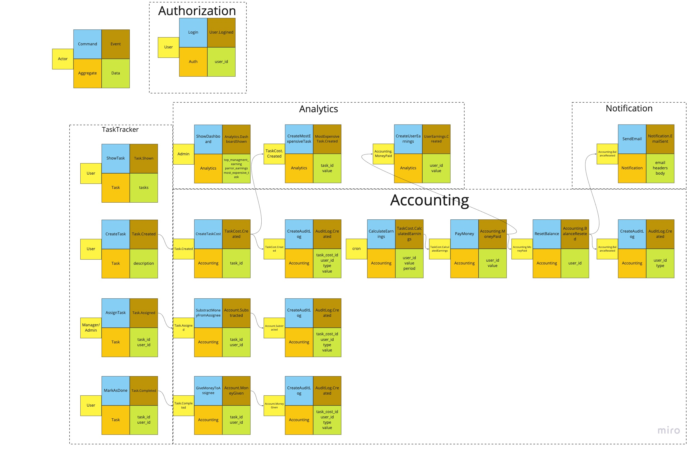

## Before:

1. Комуникация между `TaskTracker` и `Accounting` ассинхорнная
2. Сервис `Accounting` и `Analytics` общаються синхронно по API(например по cron или по запросу от пользователя). Сервис `Analytics` кэширует данные у себя.
3. Авторизация происходит в сервисе `Authorization`. Каждый сервис просто проверяет есть ли куки в базе. Если нету - переадресация в сервис авторизации
4. Redis общий для всех. Просто не хотел много стрелочек рисовать. Сервис `Authorization` сохраняет запись в Redis, все остальные сервисы только используют

## Week 1:
Здесь изображены все основные команды. Каждая команда имеет Actor, Data (которые нужны для команды) и Event который должен быть создан (с теми самыми данными). Ивенты здесь как бизнес так и CUD.

Модель данных:

